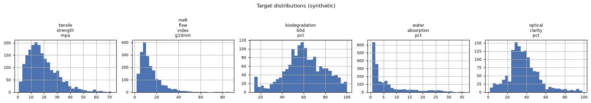
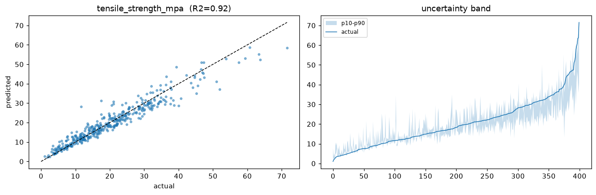
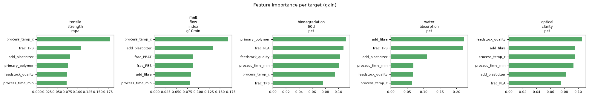
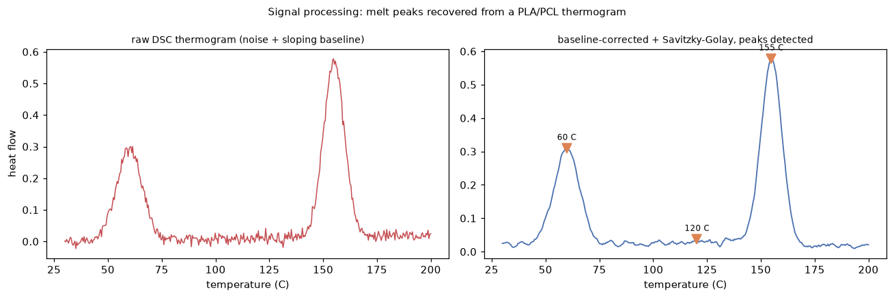
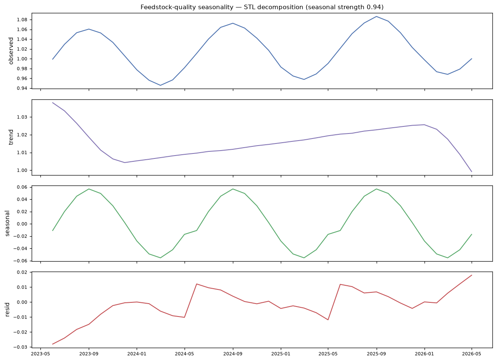

# Results (synthetic data)

> Auto-generated by `scripts/report.py`. **Synthetic, physics-informed data — not
> real-company data.** See [`DATA_CARD.md`](../DATA_CARD.md). Numbers are illustrative.

## Data
2000 rows, 24 columns; missing per target (structured, not-at-random):
tensile 0%, melt 0%, biodegradation 24%, water 0%, optical 32%.



## Forward model (LightGBM, quantile uncertainty)
| target | n | MAE | RMSE | R² | coverage | within-tol |
|---|---|---|---|---|---|---|
| tensile_strength_mpa | 400 | 2.38 | 3.38 | 0.921 | 0.57 | 0.71 |
| melt_flow_index_g10min | 400 | 1.83 | 3.09 | 0.882 | 0.58 | 0.83 |
| biodegradation_60d_pct | 294 | 3.48 | 4.72 | 0.939 | 0.54 | 0.93 |
| water_absorption_pct | 400 | 0.44 | 0.82 | 0.984 | 0.59 | 0.95 |
| optical_clarity_pct | 280 | 3.25 | 4.89 | 0.928 | 0.53 | 0.82 |

**mean R² = 0.931**




Note: processing temperature dominates tensile strength — physically correct.

## Characterisation as signal (synthetic DSC)
Polymer characterisation is signal, not tabular. A synthetic DSC thermogram per formulation is
baseline-corrected, Savitzky-Golay smoothed and peak-detected
([`signals.py`](../src/biopoly/signals.py)) to recover melt temperatures and crystallinity — the
features a scientist actually reads off the instrument, rather than hand-waving the measurement.



## Seasonality (feedstock quality over time)
Bio-feedstock purity follows an annual cycle (harvest -> storage -> depletion) on a slow
trend. It is wired into the generator
([`timeseries.py`](../src/biopoly/timeseries.py)) as a `feedstock_quality` covariate that
shifts tensile strength, so the model sees real temporal structure — and the mid-2025 supplier
shift reads as a **regime change on top** of this baseline. STL cleanly separates trend /
seasonal / residual (seasonal strength **0.94**). The honest forecast baseline
any ML model must beat is **seasonal-naive** ("next September looks like last September"): MAE
**0.0107** over a 12-month backtest, against a monthly signal SD of **0.0413**.



## Inverse design (target spec -> formulation)
**Achievable target** `{'tensile_strength_mpa': 50.0, 'optical_clarity_pct': 80.0, 'water_absorption_pct': 1.0}`
- predicted: `{'tensile_strength_mpa': 49.7, 'melt_flow_index_g10min': 10.0, 'biodegradation_60d_pct': 15.3, 'water_absorption_pct': 1.73, 'optical_clarity_pct': 75.9}`
- formulation: `{'polymers': {'PLA': 0.914}, 'additives': {'plasticizer': 0.039, 'fibre': 0.031, 'chain_extender': 0.016}, 'process_temp_c': 188.7, 'process_time_min': 17.7}`

**Conflicting target** `{'tensile_strength_mpa': 55.0, 'biodegradation_60d_pct': 85.0}` (high tensile *and* high biodegradation pull apart) —
returns the best compromise:
- predicted: `{'tensile_strength_mpa': 31.43, 'melt_flow_index_g10min': 9.0, 'biodegradation_60d_pct': 86.08, 'water_absorption_pct': 7.06, 'optical_clarity_pct': 2.67}`
- formulation: `{'polymers': {'PHA': 0.707}, 'additives': {'fibre': 0.293}, 'process_temp_c': 177.5, 'process_time_min': 12.9}`

## Drift monitoring (S1 reference vs S2 incoming)
```
drift: 1/4 columns drifted -> alert=True
  [  ok ] tensile_strength_mpa       KS=0.059 p=9.57e-02 PSI=0.062
  [DRIFT] melt_flow_index_g10min     KS=0.108 p=7.77e-05 PSI=0.099
  [  ok ] frac_PBS                   KS=0.043 p=3.91e-01 PSI=0.018
  [  ok ] primary_polymer            PSI=0.007
```
