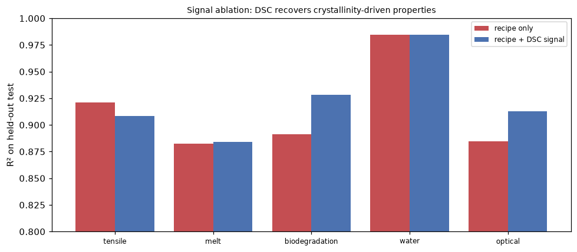
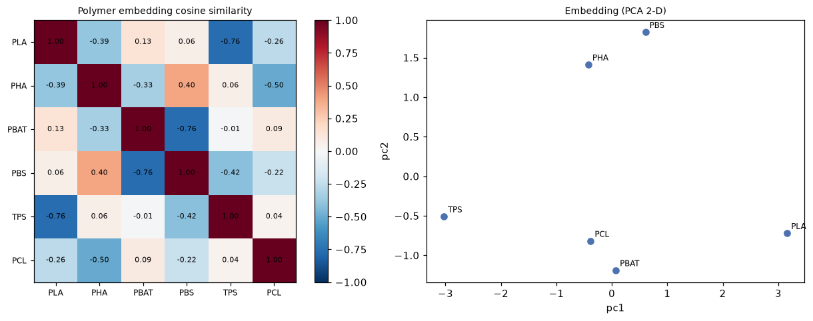
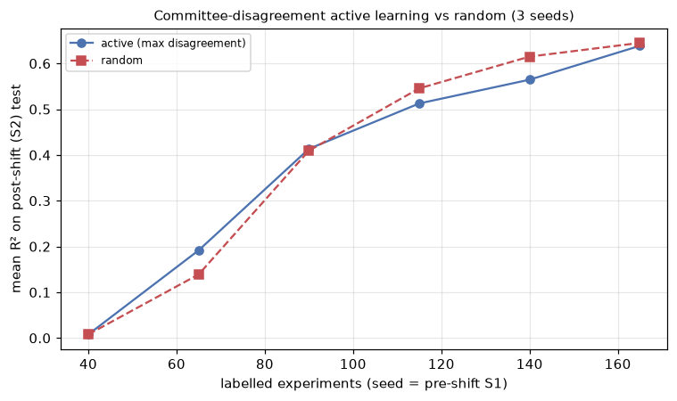
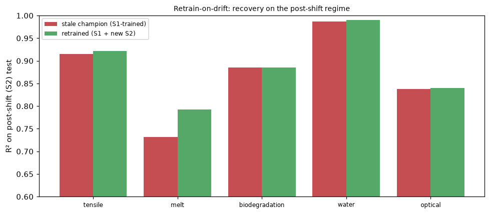

# Results (synthetic data)

> Auto-generated by `scripts/report.py`. **Synthetic, physics-informed data — not
> real-company data.** See [`DATA_CARD.md`](../DATA_CARD.md). Numbers are illustrative.

## Data
2000 rows, 24 columns; missing per target (structured, not-at-random):
tensile 0%, melt 0%, biodegradation 24%, water 0%, optical 33%.


## Forward model (LightGBM, quantile uncertainty)
| target | n | MAE | RMSE | R² | coverage | within-tol |
|---|---|---|---|---|---|---|
| tensile_strength_mpa | 400 | 2.38 | 3.38 | 0.921 | 0.57 | 0.71 |
| melt_flow_index_g10min | 400 | 1.83 | 3.09 | 0.882 | 0.58 | 0.83 |
| biodegradation_60d_pct | 295 | 4.97 | 6.40 | 0.891 | 0.53 | 0.80 |
| water_absorption_pct | 400 | 0.44 | 0.82 | 0.984 | 0.59 | 0.95 |
| optical_clarity_pct | 279 | 4.59 | 6.32 | 0.885 | 0.56 | 0.65 |

**mean R² = 0.913**


Note: processing temperature dominates tensile strength — physically correct.

## Characterisation as signal (synthetic DSC)
Polymer characterisation is signal, not tabular. A synthetic DSC thermogram per formulation is
baseline-corrected, Savitzky-Golay smoothed and peak-detected
([`signals.py`](../src/biopoly/signals.py)) to recover melt temperatures and crystallinity — the
features a scientist actually reads off the instrument, rather than hand-waving the measurement.


### Do the signal features help? An ablation
A **realized-crystallinity latent** — batch/thermal-history variation the nominal recipe does *not*
capture — drives haze and slow degradation, so a recipe-only model cannot see it. The DSC-derived
features recover it: adding them lifts **optical clarity** and **biodegradation** R² materially, at
a small honest cost on tensile (for which the thermogram is just noise). This is what makes
characterisation signal worth extracting — made measurable.

| target | recipe only | + DSC signal | Δ R² |
|---|---|---|---|
| tensile | 0.921 | 0.909 | -0.012 |
| melt | 0.882 | 0.884 | +0.001 |
| biodegradation | 0.891 | 0.929 | +0.037 |
| water | 0.984 | 0.984 | +0.000 |
| optical | 0.885 | 0.913 | +0.028 |
| **mean** | 0.913 | 0.924 | +0.011 |



## Seasonality (feedstock quality over time)
Bio-feedstock purity follows an annual cycle (harvest -> storage -> depletion) on a slow
trend. It is wired into the generator
([`timeseries.py`](../src/biopoly/timeseries.py)) as a `feedstock_quality` covariate that
shifts tensile strength, so the model sees real temporal structure — and the mid-2025 supplier
shift reads as a **regime change on top** of this baseline. STL cleanly separates trend /
seasonal / residual (seasonal strength **0.94**). The honest forecast baseline
any ML model must beat is **seasonal-naive** ("next September looks like last September"): MAE
**0.0107** over a 12-month backtest, against a monthly signal SD of **0.0413**.


## Learned polymer representation (embeddings vs descriptors)
Each polymer gets a **learned embedding** — its standardised mean property signature across the data
([`representation.py`](../src/biopoly/representation.py)). The cosine geometry is interpretable: the
closest pair is **PHA~PBS (0.40)** and the most opposed is **PLA~TPS (-0.76)**. Honest ablation: feeding a
formulation's blended embedding to the forward model does **not** beat the descriptor baseline here
(mean R² 0.913 -> 0.916) — the recipe columns already encode this — so the
embedding earns its place as an *interpretability* tool, not a predictive add-on.



## Inverse design (target spec -> formulation)
**Achievable target** `{'tensile_strength_mpa': 50.0, 'optical_clarity_pct': 80.0, 'water_absorption_pct': 1.0}`
- predicted: `{'tensile_strength_mpa': 51.52, 'melt_flow_index_g10min': 10.0, 'biodegradation_60d_pct': 16.53, 'water_absorption_pct': 0.81, 'optical_clarity_pct': 76.26}`
- formulation: `{'polymers': {'PLA': 0.96}, 'additives': {'plasticizer': 0.022, 'nucleating': 0.019}, 'process_temp_c': 196.5, 'process_time_min': 38.0}`

**Conflicting target** `{'tensile_strength_mpa': 55.0, 'biodegradation_60d_pct': 85.0}` (high tensile *and* high biodegradation pull apart) —
returns the best compromise:
- predicted: `{'tensile_strength_mpa': 31.29, 'melt_flow_index_g10min': 6.75, 'biodegradation_60d_pct': 82.66, 'water_absorption_pct': 6.16, 'optical_clarity_pct': 6.65}`
- formulation: `{'polymers': {'PHA': 0.537, 'PBAT': 0.043, 'PBS': 0.038, 'TPS': 0.016}, 'additives': {'plasticizer': 0.006, 'nucleating': 0.026, 'compatibilizer': 0.067, 'fibre': 0.251, 'chain_extender': 0.014}, 'process_temp_c': 167.7, 'process_time_min': 68.1}`

## Active learning (choosing the most informative next experiment)
Data is the binding constraint, so the next experiment should be the most *informative* one — chosen
by **expected information gain**, estimated as disagreement across a bootstrap committee of forward
models (*epistemic* uncertainty, the reducible kind — not the aleatoric measurement noise the
quantile band already captures). This reuses the inverse-design search with its objective flipped
from "hit a target" to "learn the most"
([`active_learning.py`](../src/biopoly/active_learning.py)); its concrete output is a recommended
next formulation to run.

**Does it beat random?** Benchmarked honestly — seeding from pre-shift (S1) data and scoring on the
post-shift (S2) regime. On this synthetic problem (a strong GBDT, a pool from the same distribution
as the test) committee-disagreement selection did **not** outperform random: mean R²
**0.638** vs **0.645** on the post-shift test (3 seeds). That is the
honest result — uncertainty sampling's advantage needs genuine label sparsity or a sharper epistemic
signal than a bootstrap committee provides here. The acquisition machinery is in place for the
domains (costly labels, real distribution shift) where it pays.



**Proposed next experiment** (highest information gain): `{'polymers': {'PLA': 0.827}, 'additives': {'plasticizer': 0.161, 'chain_extender': 0.012}, 'process_temp_c': 207.4, 'process_time_min': 15.3}`

## Drift monitoring (S1 reference vs S2 incoming)
```
drift: 1/4 columns drifted -> alert=True
  [  ok ] tensile_strength_mpa       KS=0.059 p=9.57e-02 PSI=0.062
  [DRIFT] melt_flow_index_g10min     KS=0.108 p=7.77e-05 PSI=0.099
  [  ok ] frac_PBS                   KS=0.043 p=3.91e-01 PSI=0.018
  [  ok ] primary_polymer            PSI=0.007
```

## Retrain on drift (detect -> retrain -> validate -> register)
An alert is only worth raising if it drives an action. The full loop runs against the supplier
shift: a champion trained on **pre-shift (S1)** data is scored on a held-out **post-shift (S2)**
test; the monitor flags `['melt_flow_index_g10min']`; a model **retrained on S1 + new S2**
is validated on the same post-shift test. The champion has degraded most on
**melt** (R² 0.732) — a feature the monitor
flagged — and retraining recovers it (R² 0.792); mean R²
0.871 -> 0.886. `register_if_better` then promotes
the retrained model only if it wins ([`registry.py`](../src/biopoly/models/registry.py),
[`scripts/retrain.py`](../scripts/retrain.py)).


